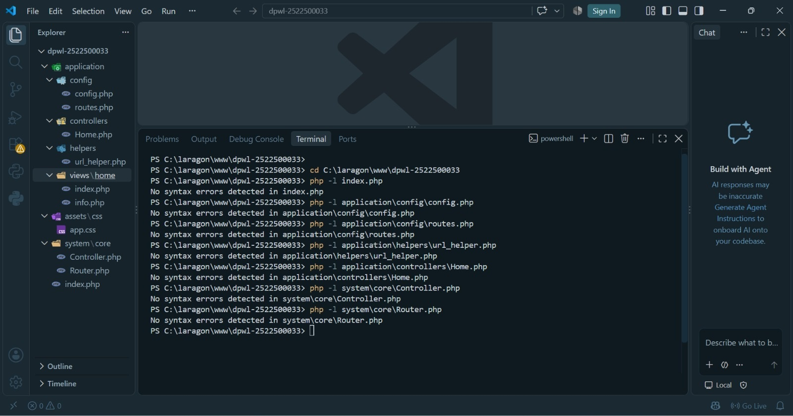
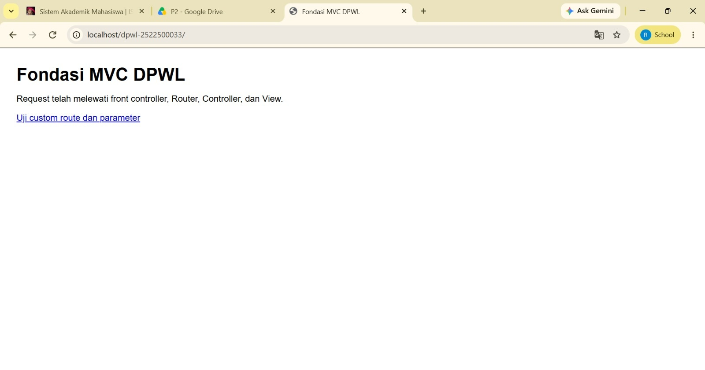
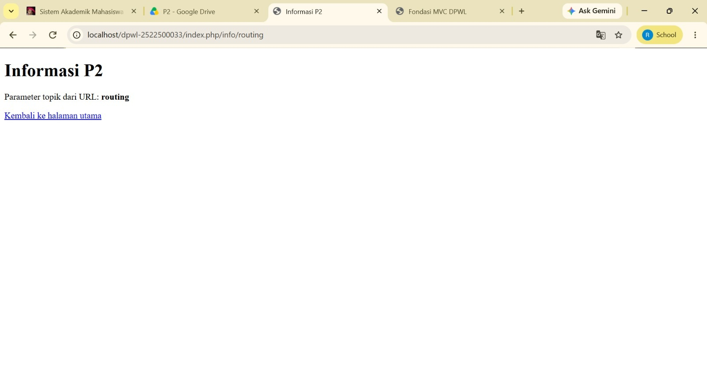

# pertemuan-02
## 1. Tujuan Praktikum
Membangun struktur proyek situs web mvc dengan mengimplementasikan front controller, routing,base URL, Helper, Controller, dan View dan menjelaskan alur interaksi request response antar komponen mvc

## 2. Struktur Direktori
[Tampilkan tree struktur P2 dan jelaskan fungsi setiap bagian.]
C:.
│   index.php
│   
├───application
│   ├───config
│   │       config.php
│   │       routes.php
│   │       
│   ├───controllers
│   │       Home.php
│   │       
│   ├───helpers
│   │       url_helper.php
│   │       
│   └───views
│       └───home
│               index.php
│               info.php
│               
├───assets
│   └───css
│           app.css
│           
└───system
    └───core
            Controller.php
            Router.php
-	Aplication/config: berfugsi menyimpan konfigurasi aplikasi 
seperti config.php pengaturan URL dasar dan routes.php aturan pemetaan rute

-	application/controllers/home.php:berfungsi sebagai class aplikasi yang menangani request setelah di petakan oleh router dan berisi class home

-	application/helpers/url_helper.php:  berisi fungsi kecil yg dapat digunakan ulang 

-	application/view/home/index.php/routes.php:berfungsi menyajikan data yang diterima ,membahas Alamat lengkap yg diterima  dan membahas aturan pemetaan URL ke controller, method/acrion dan parameter 

-	assets/css/app.css: berfungsi sebagai tempat menyimpan berkas 

-	system/core/controller.php/router.php: berfungsi dan berperan sebagai base controller serta menyediakan fungsi umum bagi controller aplikasi 

 
## 3. Front controller

Front controller adalah satu titik masuk utama untuk request yang ditujukan ke route atau fitur dinamis aplikasi. peran ini dijalankan oleh berkas index.php yang berada pada root proyek. Request terhadap route aplikasi terlebih dahulu melewati index.php, sedangkan request terhadap berkas statis seperti CSS pada folder assets/ dapat diakses langsung dan tidak dipetakan oleh Router. Front controller bertugas menyiapkan kebutuhan awal aplikasi, seperti path, konfigurasi, Helper, class inti, dan routes, kemudian menyerahkan URI kepada Router untuk menentukan Controller yang harus dijalankan

## 4. Routing dan Pemetaan URL
## 4. Routing dan Pemetaan URL
| URL/Route | Controller | Method | Parameter | View |
|---|---|---|---|---|
| / | Home | index | - | home/index.php |
| home/index | Home | index | - | home/index.php |
| home/info/mvc | Home | info | mvc | home/info.php |
| info/routing | Home | info | routing | home/info.php |
| home/info/ci3 | Home | info | ci3 | home/info.php |

-Route (home/info/ci3):
Pengguna mengakses URL http://localhost/dpwl-2522500033/home/info/ci3 pada browser. File index.php dan system/core/Router.php memecah segmen URL tersebut.

-Controller (Home):
Segmen pertama (home) mengarahkan request ke kelas controller Home.php yang berada di folder application/controllers/ Home.php.

-Method (info):
Segmen kedua (info) memanggil fungsi/method info() di dalam kelas Home.

-Parameter (ci3):
Segmen ketiga (ci3) dikirim sebagai argumen parameter variabel (misal $materi = 'ci3') ke dalam method info($materi).

-View (home/info.php):
Method info() mengolah variabel 'ci3' (misal untuk menampilkan materi Framework CodeIgniter 3) lalu merender halaman tampilan yang tersimpan di application/views/home/info.php.

## 5. Base URL dan Helper
Jelaskan fungsi base_url() dan site_url(), kemudian berikan contoh penggunaannya pada implementasi P2:
 - Base URL berfungsi menghasilkan URL lengkap ke root serta menghasilkan url asset CSS
Localhost/dwpl-2522500033/

- Site_url berfungsi menampilkan parameter routing dan  membentuk URL navigasi internal aplikasi melewati front controller 
contoh: Localhost/dpwl-nim/index.php/info/routing

## 6. Alur Request-response
Jelaskan dua alur berikut:
1. Alur eksekusi aktual P2:
Browser → index.php → Router → Controller → View → Response.
- Browser: memasukan dan mengirim request HTTP ke URL aplikasi
- Index.php: Menerima request, memuat sistem inti konfigurasi  meneruskan URI ke Router
- Router: Menganalisis URI, mencocokkan rute, menentukan Controller method parameter,  dan memanggilnya
- Controller: Menjalankan logika method, menyiapkan data tampilan, dan memanggil berkas View
- View: Menyusun dokumen HTML dan merender data
- Response: Hasil HTML dikirimkan kembali ke Browser untuk ditampilkan kepada penguna

2. Posisi Model dalam arsitektur MVC lengkap:
Browser → index.php → Router → Controller → Model → basis data/data → Model → Controller → View →

Dalam arsitektur MVC Model bertugas menangani logika bisnis data, manipulasi data, dan kueri ke basis data. Controller kemudian memanggil Model untuk mengambil atau menyimpan data sebelum meneruskan ke View. Model belum digunakan karena pengelolaan basis data baru mulai dipelajari pada P3

## 7. Hasil Pengujian dan Debugging 
Gambar 1. Hasil Pengujian dan debugging

## 8. Bukti Tangkapan Layar
Sisipkan gambar yang relevan dari folder dokumentasi/ dengan perintah:
### Gambar 1. Hasil Pengujian Halaman Utama

### Gambar 2. Hasil Pengujian Custom Route

## 9. Kesimpulan P2
kerangka mvc buatan sendiri berhasil dibangun sehingga dapat berfungsi sebagai fondasi dasar situs web dinamis dengan mengimplementasikan front controller (index.php), routing, Base URL, Helper, serta komponen Controller dan View. Kerangka ini mampu mengarahkan permintaan (request) satu titik masuk melalui front controller ke Controller dan View  sesuai berdasarkan aturan pemetaan URL. Pada pertemuan ke 3 kerangka ini akan dikembangankan dengan meanambahkan komponen  Model dan pengelolaan basis data